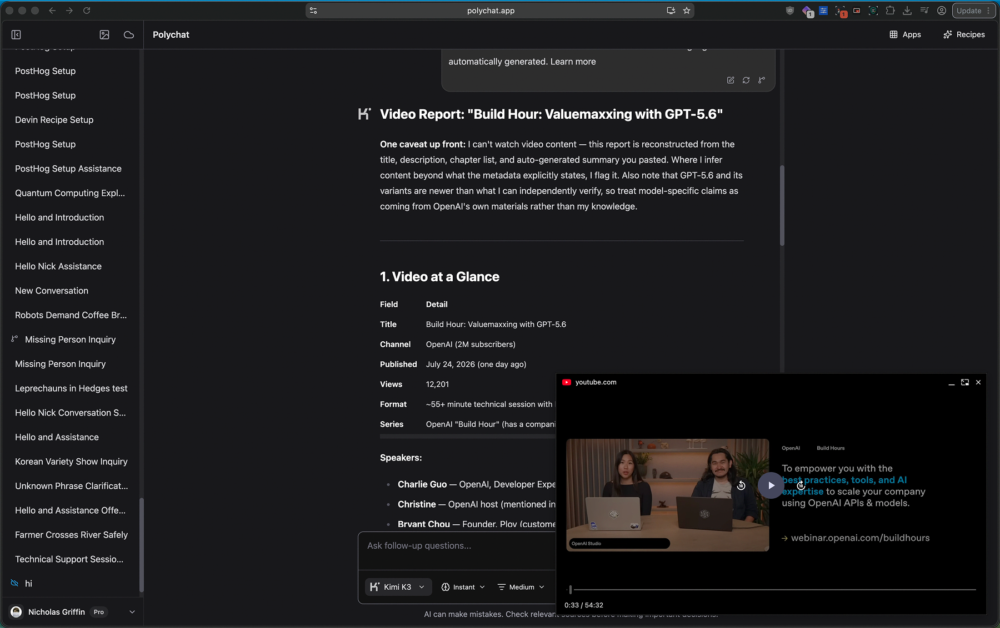

# PiP Everywhere

Pop the best video in the active Chrome tab into an always-on-top Picture-in-Picture window.


## What it does

- Chooses the most relevant playing, audible and visible video in the current tab.
- Toggles Chrome's native Picture-in-Picture player from the toolbar or `Alt+P`.
- Can include paused, finished or site-blocked videos.
- Can automatically open PiP when you leave a playing tab and close it when you return.



## How to use it

1. Play a video.
2. Click the PiP Everywhere toolbar icon or press `Alt+P`.
3. Click again to return the video to its tab.

Open the extension options to change video selection or enable automatic PiP. Automatic PiP requires Chrome 134 or later, optional access to video pages and Chrome's per-site approval.

## Install from source

1. Open `chrome://extensions`.
2. Enable **Developer mode**.
3. Select **Load unpacked** and choose this repository.

## Privacy

By default, PiP Everywhere receives temporary access to the active tab only after you invoke it. Automatic mode requests optional access to HTTP and HTTPS pages so it can detect playing video and register Chrome's media controls.

The extension stores its three preference switches in `chrome.storage.sync`, which Chrome may sync between browsers signed into the same account. It does not store or transmit page content, read browsing history, send analytics or make network requests.

## Limitations

- Chrome and individual websites may prevent Picture-in-Picture for some videos.
- Captions rendered outside the `<video>` element, including YouTube's HTML caption overlay, do not appear in Chrome's native PiP window.
- Automatic PiP depends on Chrome's version, permission and per-site approval.

## Development

```sh
pnpm check
pnpm test
pnpm run package
```
